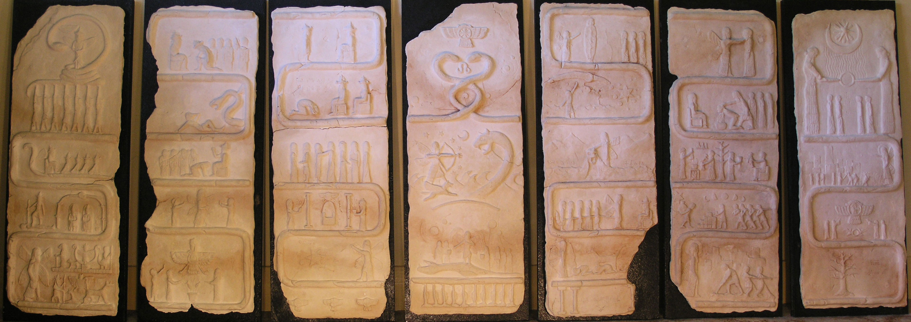

# Šumeru liḫšu (Whispers of Sumer)

The Enûma Eliš is one of the oldest creation myths that have survived into modern times.
Many years ago, a friend and I envisioned a set of seven clay tablets that attempted to capture the essence of the epic&mdash;seven of course because the Babylonian copy we still have of the story was written on seven tablets.
This was the result of months of hard work designing, translating, prototyping and moulding: seven meter tall clay tablets that look (to me at least) absolutely stunning.

I've moved to the other side of the world since then, and it's somewhat difficult to move these things&mdash;each weighing about 20 kg.
Their fate, for the moment, sees them lying buried in a storage container at my brothers house.
Perhaps one day in the future when his young children grow up and become archaeologists, they will excavate this treasure.
Or, just maybe, I'll pay some art courier a stupid sum of money to ship them to me.

Until such a time, what we have is this gallery.

[https://www.neophilus.net/whispers](https://www.neophilus.net/whispers)
